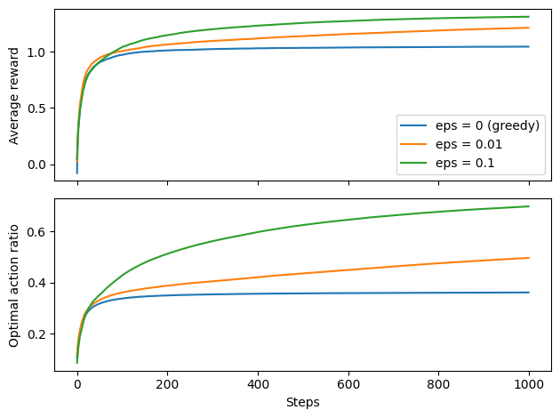
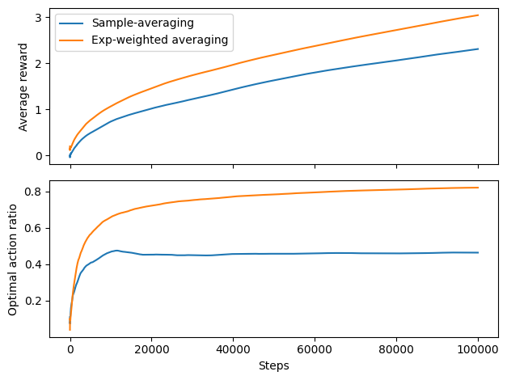
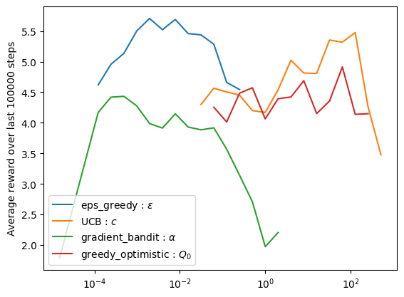

# Chapter 2

Here we explore **k-Armed Bandit** problem. The implemented algorithms are:

- $\epsilon$-greedy
- Upper-confidence bound (UCB)
- Gradient (ascent) bandit

There are two main classes: **ArmedBandit** and **NonStationaryArmedBandit**. The former has fixed true action values $q(a)$, drawn from gaussian distribution with zero mean and unit variance. In this case we reproduce plots from Sutton-Barto, averaged over 500 runs: 

For the non-stationary case, the true action values initially take the same value $Q_0$ for all actions. Then at each time step values for each action take independent random walks $q(a) \to q(a) + \delta q(a)$ with $\delta q(a)$ drawn from gaussian distribution with zero mean and tunable variance (0.01 default value). Stats averaged over 100 runs: 

Finally, for a non-stationary problem we carry out a parameter study for performance of various algorithms: 

