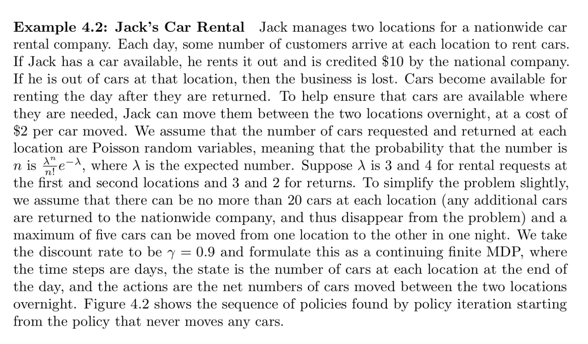
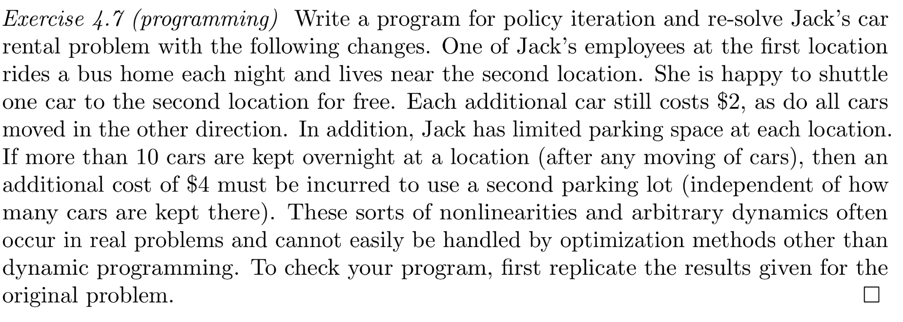
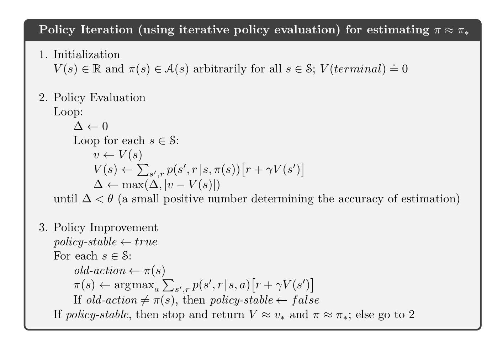

# Jack's Car Rental

This is an implementation of Example 4.2 and problem 4.7 in Sutton-Barto: 

We use the policy iteration algorithm:

**Transition probabilites**

The state space is $s = (n_1 , n_2)$, where $n_i$ is the number of cars at i'th location. Let's work out the transition probabilities according to Poisson distributions described in the problem. For now we do not consider moving cars from one location to another, but simply work out probabilites for a transition from a state with $n$ cars to a state with $n'$ cars at one location.

The Poisson distributions for requests and returns are 

$$
p_{\lambda_{\text{req}}} (n_{\text{req}}) = {\lambda_{\text{req}}^{n_{\text{req}}} \over n_{\text{req}}!} \ e^{-\lambda_{\text{req}}} \ ,
\qquad
p_{\lambda_{\text{ret}}} (n_{\text{ret}}) = {\lambda_{\text{ret}}^{n_{\text{ret}}} \over n_{\text{ret}}!} \ e^{-\lambda_{\text{ret}}}
$$

To work out the transition probablilites $P_{n\to n'}$ it is convenient to split transitions into two steps:

$$n \quad \to \quad n - n_{\text{req}} \quad \to \quad n - n_{\text{req}} + n_{\text{ret}} = n'$$

The transition probabilities are

$$
\begin{align}
\nonumber
P_{n \to n'}^{(\text{inf})} &=
\sum_{n_{\text{req}}, n_{\text{ret}} = 0}^\infty p_{\lambda_{\text{req}}} (n_{\text{req}})p_{\lambda_{\text{ret}}} (n_{\text{ret}})
\left[ 
\theta(n_{\text{req}} \leq n-1) \delta_{n-n_{\text{req}}+n_{\text{ret}}, n'} + 
\theta(n_{\text{req}} \geq n) \delta_{n_{\text{ret}}, n'}
\right]
\\
&= \sum_{n_{\text{req}} = \max(0, n-n')}^{n-1} p_{\lambda_{\text{req}}} (n_{\text{req}})  p_{\lambda_{\text{ret}}} (n'-n + n_{\text{req}}) 
\quad + \quad 
\left( 1- \sum_{n_{\text{req}} = 0}^{n-1} p_{\lambda_{\text{req}}} (n_{\text{req}}) \right)  p_{\lambda_{\text{ret}}} (n')
\tag{1}
\end{align}
$$

The 2nd term accounts for the fact that if the number of requests is greater or equal than the number of available cars $n_{\text{req}} \geq n$, then we can only fulfill $n$ requests and the number of cars before returns is zero, such that $n' = n_{\text{ret}}$. In the first term in the LHS the sum starts at $n_{\text{req}} = \max(0, n-n')$. This is due to the fact that $n_{\text{ret}} = n'-n + n_{\text{req}} \geq 0 $, i.e. $n_{\text{req}} \geq n - n'$.

Note that above there is no restriction on $n,n'$. The superscript 'inf' in $P_{n \to n'}^{(\text{inf})}$ reminds us of that. If we're allowed only up to $n_{\text{max}}$ cars at a location, while extra cars are taken away, then transition probabilities are

$$
P_{n\to n'} = 
\begin{cases}
P_{n \to n'}^{(\text{inf})} \ , \qquad \qquad \qquad \quad \text{if} \quad 0 \leq n' \leq n_{\text{max}}-1 \\
1-\sum_{n'=0}^{ n_{\text{max}}-1} P_{n\to n'}^{(\text{inf})} \ , \qquad \text{if} \quad n' = n_{\text{max}}
\end{cases}
\tag{2}
$$

The probability $p(s'|s,a)$ of starting with $s = (n_1, n_2)$ cars at two locations, moving $a$ cars from 1st location to 2nd and ending up with $s' = (n_1', n_2')$ cars, is

$$
p(s'|s,a) = P_{n_1 - a \to n_1'} P_{n_2 + a \to n_2'} \tag{3}
$$

**Expected rewards**

The rewards depend only on the number of available cars and the number of requests. Suppose that we have $n$ cars at one location. Then the expected reward is

$$
R_n = \text{rent} \cdot \sum_{n_{\text{req}} = 0}^{n-1} n_{\text{req}} \ p_{\lambda_{\text{req}}} (n_{\text{req}})
+
\text{rent} \cdot n \left( 1- \sum_{n_{\text{req}} = 0}^{n-1} p_{\lambda_{\text{req}}} (n_{\text{req}}) \right)
\tag{4}
$$
where $\text{rent}$ is daily rent for a car. The second term takes into account that we can rent out at most $n$ cars even if there are many requests.

Now we take into account that there are two locations and we can move $a$ cars between them by paying $\text{cost}$ for each moved car. The full expected reward given a state $s = (n_1, n_2)$ and action $a$

$$\tag{5}
r(s, a) = R_{n_1 - a} + R_{n_2 + a} - \text{cost} \cdot |a|
$$

**Constraints on actions** 

The number of cars that can be moved are constrained by the number of available cars, maximum cars at each location $n_{\text{max}}$ and the maximum cars that can be moved at once $M$. Suppose we are in a state $s = (n_1, n_2)$. After moving $a$ cars we have $(n_1 - a, n_2 + a)$ cars. We must have

$$
0 \leq n_1 - a \leq n_{\text{max}} \ , \qquad 0 \leq n_2 + a \leq n_{\text{max}} \ , \qquad |a| \leq M
$$

This is equivalent to

$$\tag{6}
-\min(M, n_{\text{max}} - n_1, n_2) \leq a \leq \min(M, n_1, n_{\text{max}} - n_2)
$$

**Bellman equation**

The Bellman equation for our problem for the value function $v_{\pi}(s)$ given a deterministic policy $a = \pi(s)$, takes the form

$$
v_{\pi} (s) = r(s, \pi(s)) + \gamma \sum_{s'} p(s'|s,\pi(s)) v_{\pi}(s')
$$

Updates for policy evaluation and policy improvement are also straightforward to write down using function $p(s'|s,a), r(s,a)$ given in eqs. (3), (5).

