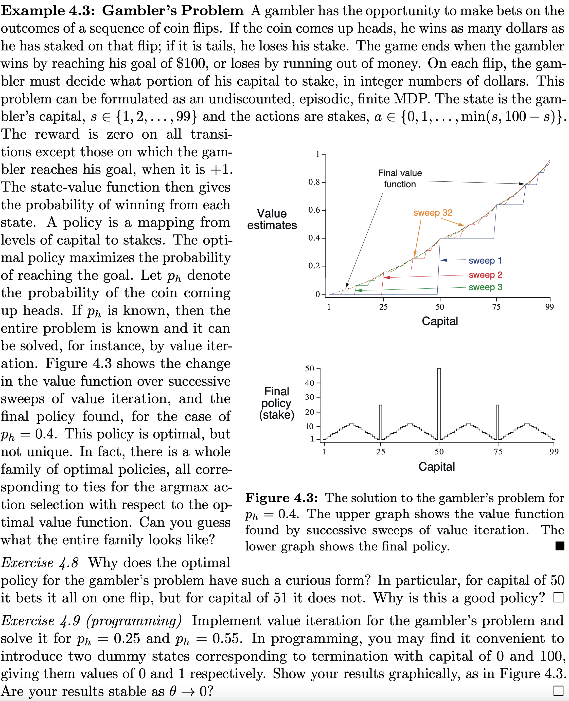

# Gambler's Problem

The state space is:

$$
S = \{ 1, \dots, 99 \} \ , \qquad S_{\text{terminal}} = \{ 0, g \} \ , \qquad g = 100
$$
where $g$ is the goal. The action space $A(s)$ corresponding to a state $s \in S$ is 

$$
A(s) = \{ 1, \dots, \min(s, g - s) \}
$$

Note that we do not include the action $a = 0$, since betting nothing doesn't change the state at all and is equivalent to skipping the coin flip.

The dynamics of the environment is determined by transition probabilites

$$
p(s'|s,a) = 
\begin{cases}
p_h \ ,  &\text{if} \quad s' = s + a \\
1 - p_h \ ,  &\text{if} \quad s' = s - a \\
0 \ , & \text{otherwise}
\end{cases}
$$

The expected rewards is also easy to compute. We always get $0$ reward, unless the final state is the goal $s' = s + a = g$. And this happens with probability $p_h$

$$
r(s,a) = p_h \delta_{s+a, g}
$$

Finally, the update rule for the value iteration algorithm is

$$
\begin{align} \nonumber
v_{k+1}(s) &= \max_{a \in A(s)} \left( r(s,a) + \sum_{s'} p(s'|s,a)v_k(s') \right) \\
&= \max_{a \in A(s)} \left( p_h \delta_{s+a, g} + p_h v_k(s+a) + (1-p_h) v_k(s-a) \right) 
\end{align}
$$